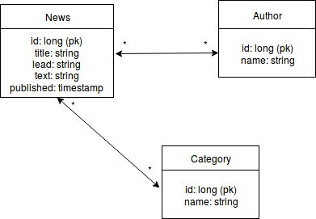

## Description

Great News is a news application for listing the latest great news. It offers user the ability to read latest articles on the application and create new ones. Articles can be related to multiple categories and they can be written by many authors. Users are able to edit existing articles or delete them if needed. 

## Database structure

## User Stories

* As a user I am able to view latest news on the main page
* As a user I can view a single article and see the full text
* As a user I am able to filter news by a category
* As a user I am able to create new articles
* As a user I am able to delete and edit existing articles

## Missing features

* Articles have pictures
* News can be sorted by most viewed during last week
* News can be sorted by author
* Login system - only registered users can create and edit articles
* Tests